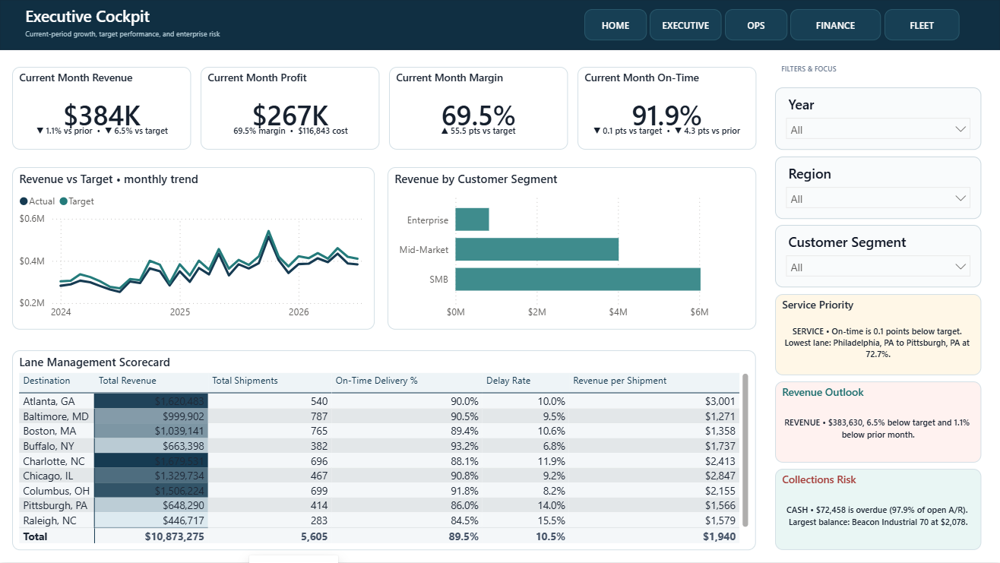
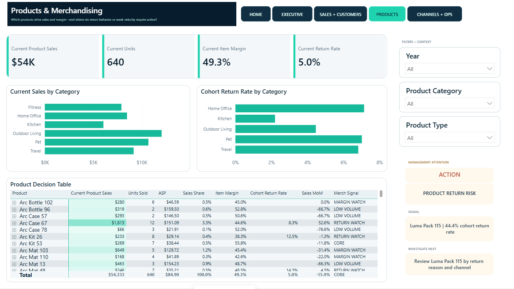

# Ecenur Keskin - Data & Business Intelligence Portfolio

Industrial Engineering perspective applied to supply chain, operations, analytics, and business intelligence.

I use data to clarify how a business is operating: what is driving performance, where risk is accumulating, and which management action the evidence supports. These five Power BI case studies demonstrate dimensional modeling, measure design, data validation, KPI architecture, and decision-focused communication across several operating environments.

> Portfolio disclosure: The companies and datasets in this repository are simulated work-sample scenarios. They do not represent clients, employers, confidential data, or paid engagements.

## Selected work

### 1. CedarVale Freight Partners - flagship

**Logistics operations | revenue | service reliability | receivables | drivers | fleet**

A management decision system connecting commercial performance to delivery reliability, customer exposure, lane risk, and fleet cost. The latest displayed period surfaces revenue below target, a small on-time gap, lane exceptions, overdue receivables, and vehicle-level downtime/maintenance signals.

[Read the CedarVale case study](projects/cedarvale-freight-partners/README.md)

### 2. LumaTrail Market - major case study

**E-commerce | revenue drivers | AOV | customers | products | returns | channels | inventory**

A commerce intelligence workspace that separates order volume from basket economics and connects category/product performance to supported margin, returns, channel efficiency, and inventory follow-up.

[Read the LumaTrail case study](projects/lumatrail-market/README.md)

### 3. Pinebridge Dental Arts

**Practice operations | appointments | attendance quality | providers | collections | claims**

A practice-performance model linking access and provider productivity to cancellations, no-shows, collections, receivables, insurance claims, and treatment mix.

[Read the Pinebridge case study](projects/pinebridge-dental-arts/README.md)

## Additional industry work

- [Ember & Oak Kitchen](projects/ember-oak-kitchen/README.md) - restaurant sales, menu economics, food cost, purchasing, customers, and a deliberate labor data-governance hold.
- [Frostline Home Comfort](projects/frostline-home-comfort/README.md) - field-service demand, technician capacity, first-time fix, utilization, CSAT, customers, and Direct Service Contribution.

## Core capabilities

- **Business and operations:** supply chain, logistics, service operations, process thinking, KPI definition, variance analysis, working-capital awareness
- **Data and modeling:** Power Query, dimensional modeling, relationship logic, DAX measures, validation, data-quality controls, analytical limitations
- **BI and communication:** Power BI, executive dashboards, drill paths, scorecards, management narratives, information hierarchy

## Repository contents

- [`website/`](website/) - recruiter-facing portfolio site source with five case-study routes
- [`projects/`](projects/) - concise GitHub case-study READMEs
- [PDF work sample](output/pdf/Ecenur_Keskin_BI_Portfolio_Work_Sample.pdf) - seven-page application-ready portfolio summary

The finished Power BI development projects, raw data, internal QA evidence, rollback snapshots, and build scripts are intentionally not included in this public package.
