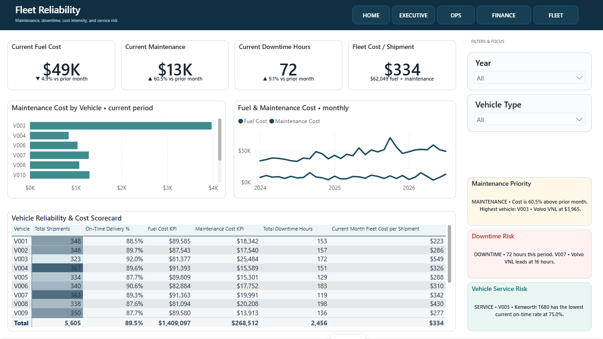

# CedarVale Freight Partners

**Flagship case study | Logistics operations | Power BI**

CedarVale is a simulated portfolio case study. It demonstrates how an analyst can connect commercial performance, service reliability, receivables, customer concentration, drivers, and fleet risk without overstating what the source data can support.

## Business challenge

Management needed one operating view of revenue, service performance, customer exposure, and fleet reliability. Revenue alone could not show whether growth was arriving with consistent delivery, healthy collections, or controlled fleet cost.

## Solution

A five-page management workspace moves from an executive cockpit into operations, finance and customers, and fleet reliability. Target comparisons, exception panels, and scorecards convert results into a practical follow-up sequence.

## Key business questions

- Where is revenue ahead or behind plan, and which customer segments drive it?
- Which lanes, routes, drivers, or vehicles create the greatest service risk?
- How concentrated is open and overdue receivables exposure?
- Are fuel, maintenance, and downtime trends threatening delivery reliability?

## Analytical approach

- Related shipment, customer, route, driver, vehicle, fuel, maintenance, invoice, payment, date, and target data in a governed semantic model.
- Separated outcomes from diagnostic drivers so users can move from variance to operational cause.
- Used current-period KPIs, trend context, ranked exceptions, and detail scorecards.

## Key decision signals

Revenue and target variance; operating result and margin; shipments; revenue per shipment; on-time delivery; delay rate; fuel and maintenance cost; downtime; open and overdue receivables.

## Management insights

- Latest displayed revenue is $384K, 6.5% below target; on-time delivery is 91.9% and slightly below target.
- The lane scorecard exposes uneven service performance, including the Pittsburgh destination at 86.0% on-time.
- The cockpit elevates $72K of overdue cash exposure and identifies the largest open customer balance.
- Fleet reporting links maintenance and downtime exceptions to vehicle-level service risk.

## Analytical judgment and limitations

Fleet utilization and route- or customer-level profitability were not presented because the available fields do not support defensible calculations. Those measures were intentionally withheld rather than fabricated.

## Tools and skills

Power BI, Power Query, DAX, dimensional modeling, logistics analytics, KPI design, receivables analysis, data validation, management communication.
