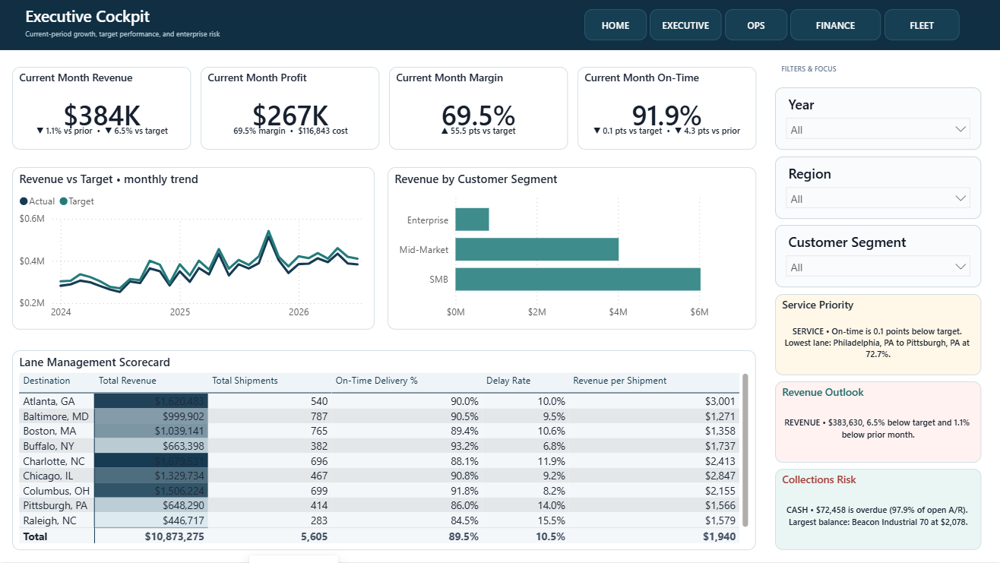
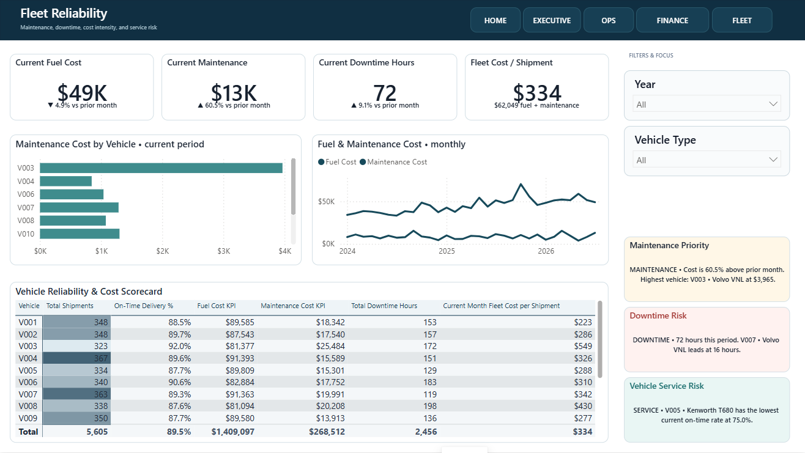

# CedarVale Freight Partners

**Logistics operations | Power BI**

CedarVale is a simulated logistics case study. I used it to examine how revenue, service reliability, receivables, customer concentration, driver performance, and fleet cost affect one another.

## Why I built it

Management needed a single view of commercial performance and service risk. Revenue by itself could not show whether deliveries were reliable, customer balances were being collected, or fleet costs were under control.

## What the report covers

The five-page report moves from an executive overview to operations, finance and customers, and fleet reliability. It combines current results, target comparisons, trends, exception panels, and detailed scorecards.

## Questions I worked through

- Where is revenue ahead or behind plan, and which customer segments drive the result?
- Which lanes, routes, drivers, or vehicles create the greatest service risk?
- How concentrated is open and overdue receivables exposure?
- Are fuel, maintenance, and downtime trends threatening delivery reliability?

## Data and modeling

- I related shipment, customer, route, driver, vehicle, fuel, maintenance, invoice, payment, date, and target data in a dimensional model.
- I kept outcome measures separate from diagnostic measures so a user can move from a variance to a likely operating cause.
- I used current-period KPIs, trend context, ranked exceptions, and detail scorecards to support follow-up.

## Findings shown in the report

- Latest displayed revenue is $384K, 6.5% below target; on-time delivery is 91.9% and slightly below target.
- The lane scorecard shows uneven service performance, including the Pittsburgh destination at 86.0% on-time.
- The executive page highlights $72K of overdue cash exposure and identifies the largest open customer balance.
- The fleet page connects maintenance and downtime exceptions with vehicle-level service risk.

## What I did not calculate

I did not calculate fleet utilization or route- or customer-level profitability because the available fields do not support those measures.

## Built with

Power BI, Power Query, DAX, dimensional modeling, logistics analysis, KPI definitions, receivables analysis, and data validation.
