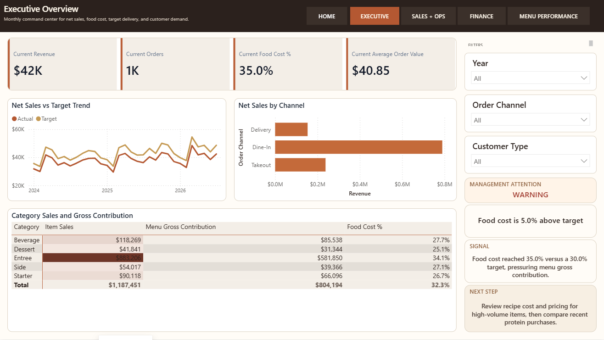
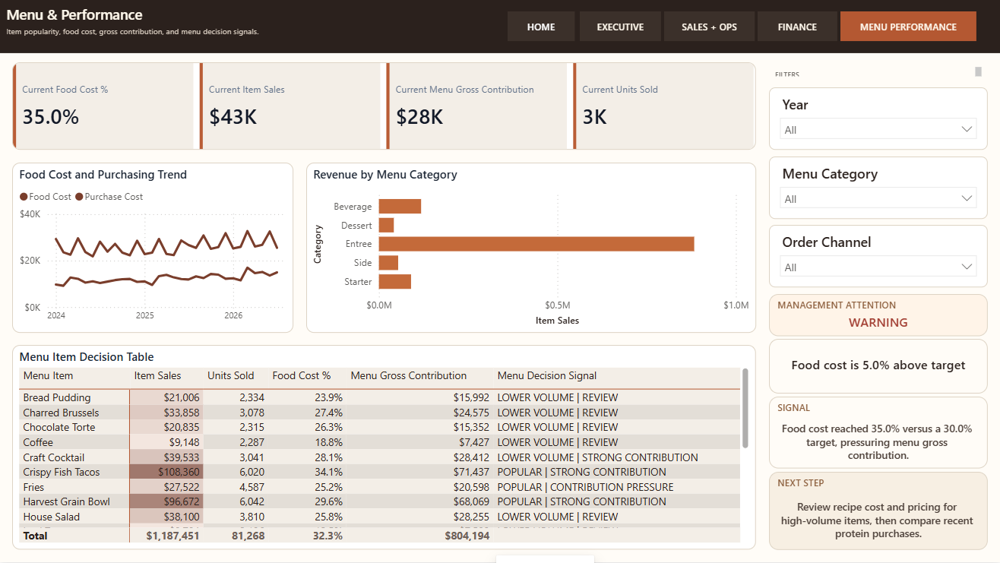

# Ember & Oak Kitchen

**Supporting case study | Restaurant operations | Power BI**

Ember & Oak is a simulated portfolio case study for owner/operator decisions across sales, menu economics, food cost, purchasing, channels, and customers.

## Business challenge

The owner needed to connect sales growth with menu mix, food cost, purchasing, channel demand, and the economics of high-volume items.

## Solution

A restaurant management workspace focuses on net sales, order value, food-cost pressure, menu gross contribution, purchasing patterns, and item/category decision signals.

## Key decision signals

Net sales; orders; AOV; food cost %; menu gross contribution; units sold; channel mix; category mix; purchasing trend.

## Management insights

- Latest displayed revenue is $42K and food cost is 35.0%.
- Food cost is 5.0 points above the 30.0% target, directing review toward recipes, pricing, and recent protein purchases.
- The item decision table distinguishes popular, strong-contribution items from lower-volume items needing review.

## Data governance strength

Labor source data was inconsistent enough that labor-based margin and downstream profitability measures were placed on Source Hold. They were intentionally withheld rather than used to present a misleading profit result. Menu gross contribution is not described as operating profit.

## Tools and skills

Power BI, Power Query, DAX, menu engineering, purchasing analysis, KPI design, data governance.
