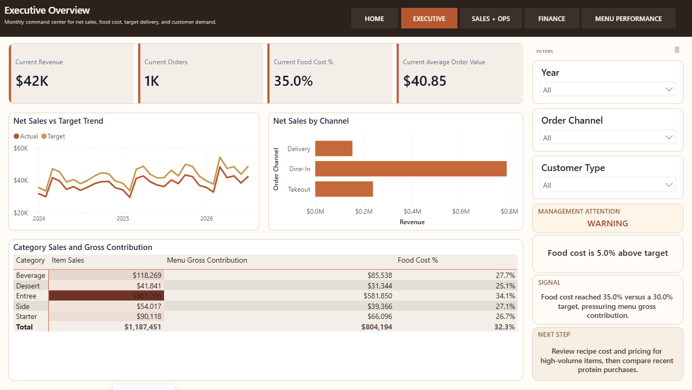
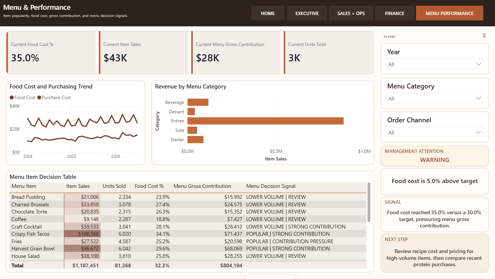

# Ember & Oak Kitchen

**Restaurant operations | Power BI**

Ember & Oak is a simulated restaurant case study covering sales, menu economics, food cost, purchasing, channels, and customers.

## Owner's question

The owner needed to understand how sales growth, menu mix, food cost, purchasing, channel demand, and high-volume items affected the business.

## What I built

The report covers net sales, orders, average order value, food-cost pressure, menu gross contribution, purchasing patterns, channel mix, and item- and category-level results.

## Findings

- Latest displayed revenue is $42K and food cost is 35.0%.
- Food cost is 5.0 points above the 30.0% target, directing review toward recipes, pricing, and recent protein purchases.
- The item table separates popular, strong-contribution items from lower-volume items that need review.

## Labor-data limitation

The labor source failed consistency checks. I placed labor-based margin and downstream profitability measures on Source Hold instead of presenting a result I could not validate. Menu gross contribution is not described as operating profit.

## Built with

Power BI, Power Query, DAX, menu engineering, purchasing analysis, KPI definitions, and data validation.
