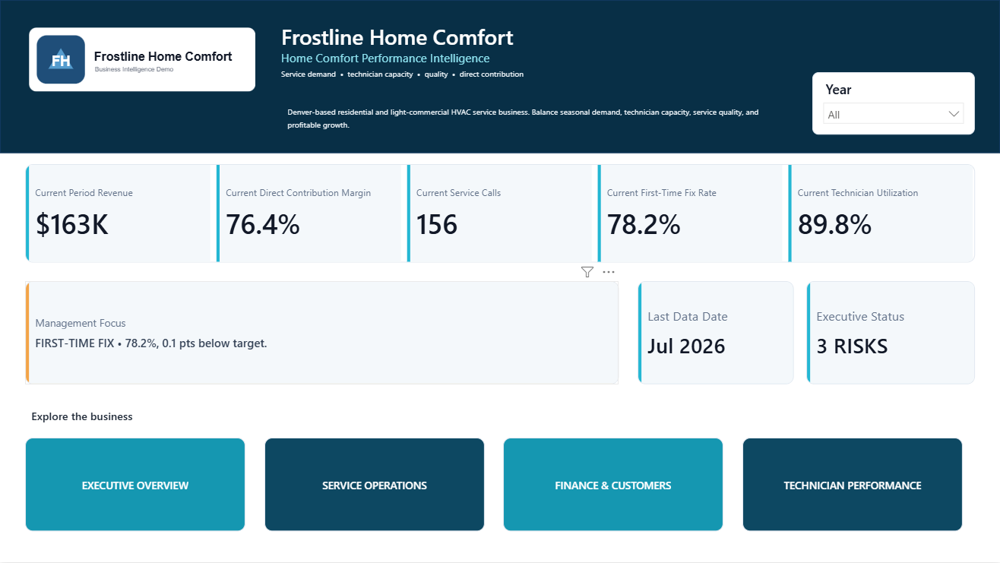
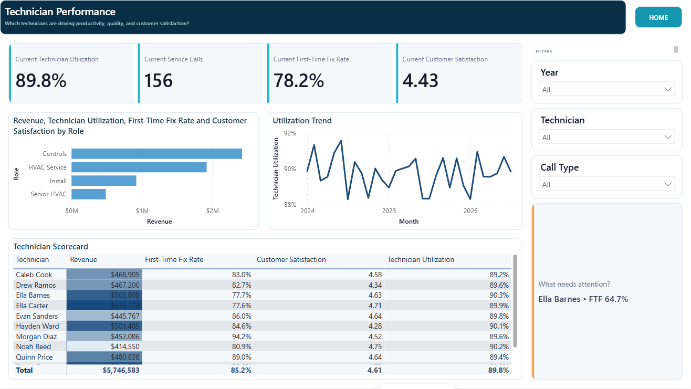

# Frostline Home Comfort

**Supporting case study | Field-service operations | Power BI**

Frostline is a simulated portfolio case study for service demand, technician capacity, first-time fix, utilization, customer satisfaction, customers, and direct service economics.

## Business challenge

Service leaders needed to balance weather-driven demand and technician capacity while protecting first-time fix, customer satisfaction, and direct service contribution.

## Solution

A field-service reporting system covers the executive picture, service operations, finance and customers, and technician performance.

## Key decision signals

Revenue; service calls; average ticket; technician utilization; first-time fix; CSAT; Direct Service Contribution; open/completed work; repeat-visit and technician exceptions.

## Management insights

- The latest displayed period shows $163K revenue, 156 service calls, and 89.8% technician utilization.
- First-time fix is 78.2% and slightly below target, creating the immediate management focus.
- The technician view combines revenue with utilization, first-time fix, and customer satisfaction instead of ranking performance on one metric.

## Analytical judgment and limitations

Direct Service Contribution is not operating profit. It excludes broader operating expenses that are not present in the source and is labeled accordingly.

## Tools and skills

Power BI, Power Query, DAX, field-service analytics, capacity analysis, technician scorecards, customer and service-quality analysis.
