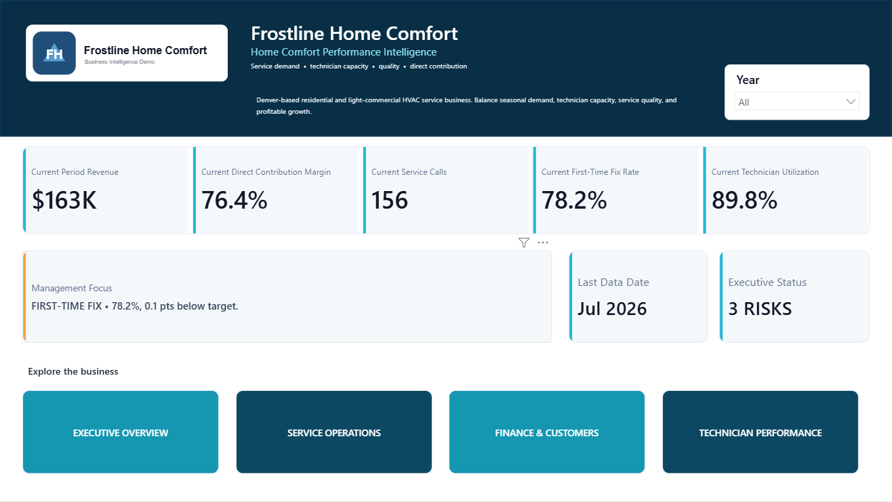
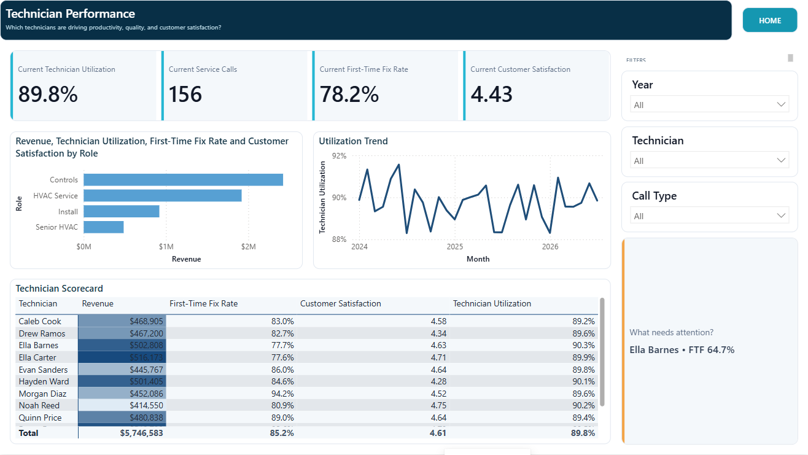

# Frostline Home Comfort

**Field-service operations | Power BI**

Frostline is a simulated field-service case study covering seasonal demand, technician capacity, first-time fix, utilization, customer satisfaction, customers, and direct service economics.

## Operations question

Service leaders needed to balance weather-driven demand and technician capacity without losing first-time-fix performance, customer satisfaction, or direct service contribution.

## Report coverage

The report moves from an executive overview to service operations, finance and customers, and technician performance. Technician scorecards combine productivity, first-time fix, utilization, and CSAT rather than ranking technicians on revenue alone.

## Findings

- The latest displayed period shows $163K revenue, 156 service calls, and 89.8% technician utilization.
- First-time fix is 78.2% and slightly below target, making it the clearest current service issue.
- The technician view combines revenue with utilization, first-time fix, and customer satisfaction.

## Metric boundary

Direct Service Contribution is not operating profit. I calculated it from directly attributable service revenue and costs; broader operating expenses are not present in the source data.

## Built with

Power BI, Power Query, DAX, field-service analysis, capacity analysis, technician scorecards, and customer and service-quality analysis.
