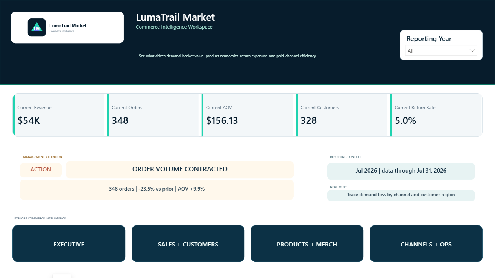

# LumaTrail Market

**Major case study | E-commerce and merchandising | Power BI**

LumaTrail is a simulated portfolio case study focused on revenue drivers, customer demand, product economics, returns, channels, and inventory decisions.

## Business challenge

The business needed to determine whether revenue movement came from order volume or average order value while protecting margin and identifying product, return, channel, and inventory risks.

## Solution

A five-page commerce intelligence workspace organizes executive performance, sales and customers, product merchandising, and channels/operations around the decisions each audience needs to make.

## Key business questions

- Is revenue movement driven by order volume, average order value, or both?
- Which products combine sales scale, supported margin, and acceptable return behavior?
- Where do channels create efficient demand versus costly volume?
- Which products require pricing, return-reason, or inventory review?

## Analytical approach

- Connected orders, order lines, customers, products, returns, marketing spend, inventory, dates, and targets.
- Kept volume, value, margin, and return signals separate to avoid treating revenue as a complete result.
- Built product decision tables and exception labels to create a merchandising work queue.

## Key decision signals

Revenue; orders; units; AOV; customers; product gross margin where supported; return rate; refunds; channel efficiency; inventory signals.

## Management insights

- Latest displayed revenue is $54K from 348 orders at a $156.13 AOV.
- Orders are down 23.5% versus the prior period while AOV is up 9.9%, isolating volume contraction as the immediate demand problem.
- The product view shows a 49.3% item margin and 5.0% cohort return rate for the displayed period.
- Luma Pack 115 is flagged at a 44.4% cohort return rate for return-reason and channel investigation.

## Analytical judgment and limitations

Gross margin is used only where the item-level source supports it. The case study does not claim causal marketing lift or lifetime customer value outside the observed portfolio data.

## Tools and skills

Power BI, Power Query, DAX, dimensional modeling, commerce analytics, merchandising analysis, channel analysis, exception design.
