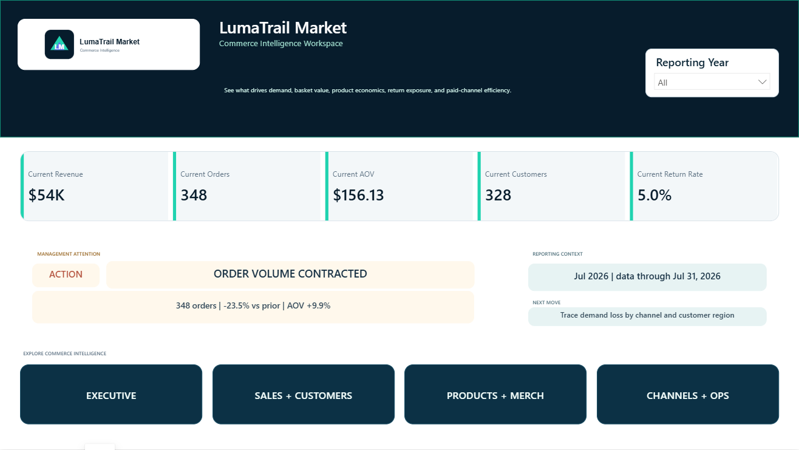
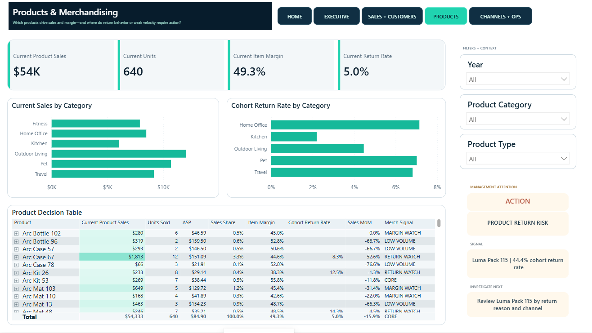

# LumaTrail Market

**E-commerce and merchandising | Power BI**

LumaTrail is a simulated e-commerce case study focused on revenue drivers, customer demand, product economics, returns, channels, and inventory.

## Business question

The main question was whether revenue movement came from order volume, average order value, or both. The report also needed to keep product margin, returns, channel performance, and inventory visible.

## What I built

The five report pages cover the executive view, sales and customers, products and merchandising, and channels and operations. The home page states the current demand issue before the user moves into the detailed pages.

## What I analyzed

- Orders, order lines, customers, products, returns, marketing spend, inventory, dates, and targets
- Revenue, orders, units, AOV, customers, product gross margin where supported, return rate, refunds, channel efficiency, and inventory signals
- Product-level combinations of sales, margin, returns, velocity, and stock position

## Findings

- Latest displayed revenue is $54K from 348 orders at a $156.13 AOV.
- Orders are down 23.5% versus the prior period while AOV is up 9.9%, so lower order volume is the immediate demand issue.
- The product view shows a 49.3% item margin and a 5.0% cohort return rate for the displayed period.
- Luma Pack 115 is flagged at a 44.4% cohort return rate for return-reason and channel review.

## Data boundaries

I used gross margin only where the item-level source includes the required cost fields. I did not claim causal marketing lift or lifetime customer value beyond the observed portfolio data.

## Built with

Power BI, Power Query, DAX, dimensional modeling, e-commerce analysis, merchandising analysis, channel analysis, and exception reporting.
