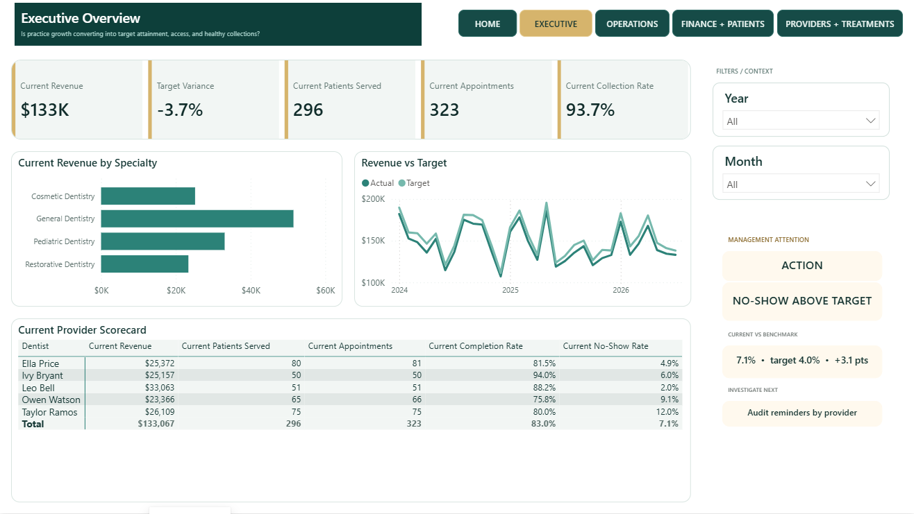
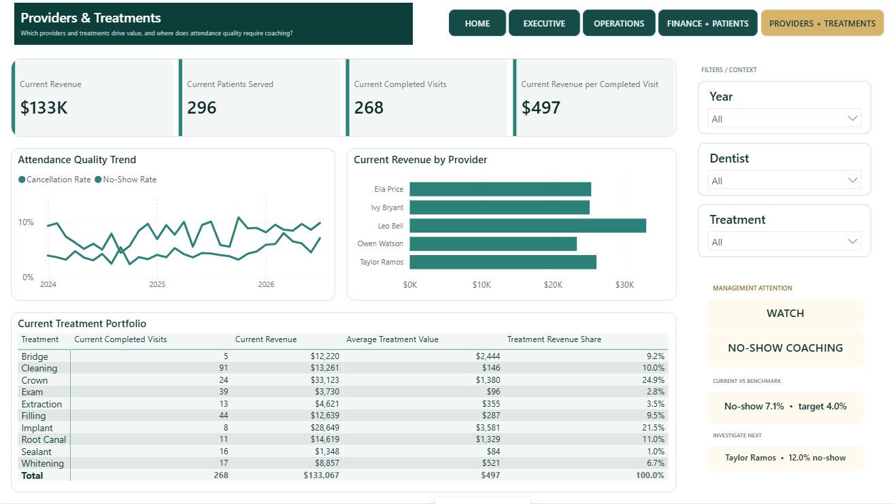

# Pinebridge Dental Arts

**Healthcare operations case study | Power BI**

Pinebridge is a simulated portfolio case study linking appointment access and provider productivity with attendance quality, collections, receivables, insurance claims, and treatment mix.

## Business challenge

Practice leaders needed to balance appointment access and provider productivity with cancellations, no-shows, collection health, and insurance follow-up.

## Solution

A five-page clinical-business reporting experience spans executive performance, practice operations, finance and patients, and providers/treatments.

## Key business questions

- Is growth converting into completed visits and target attainment?
- Which providers need attendance or scheduling support?
- How do treatments contribute to volume and revenue mix?
- Where are collections, receivables, or claim delays building?

## Key decision signals

Revenue and target variance; patients served; appointments and completed visits; cancellation and no-show rates; collection rate; receivables; claims; revenue per completed visit.

## Management insights

- The latest displayed period reports $133K revenue, 296 patients served, and 323 appointments.
- No-shows are 7.1% against a 4.0% target.
- The provider view identifies Taylor Ramos at a 12.0% no-show rate for targeted coaching.
- Treatment mix connects completed visits with value per visit and revenue share.

## Analytical judgment and limitations

First-visit logic represents the earliest observed visit in the available dataset. It is not a lifetime acquisition date and is not presented as customer acquisition beyond the observed history.

## Tools and skills

Power BI, Power Query, DAX, healthcare operations analytics, provider scorecards, claims and receivables analysis, data validation.
