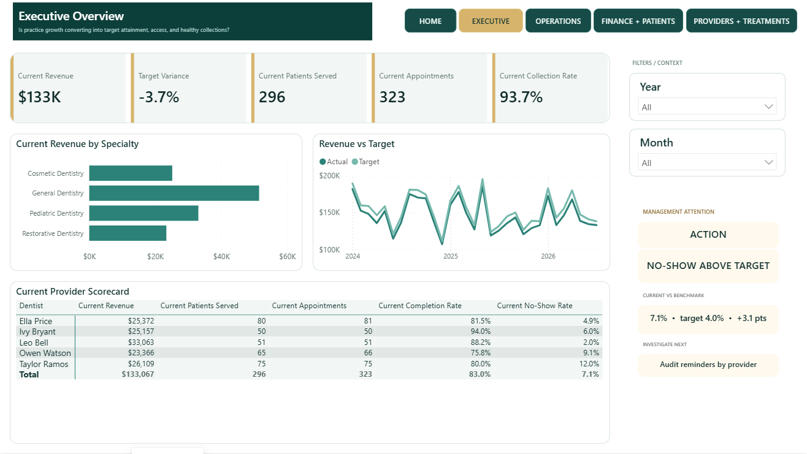
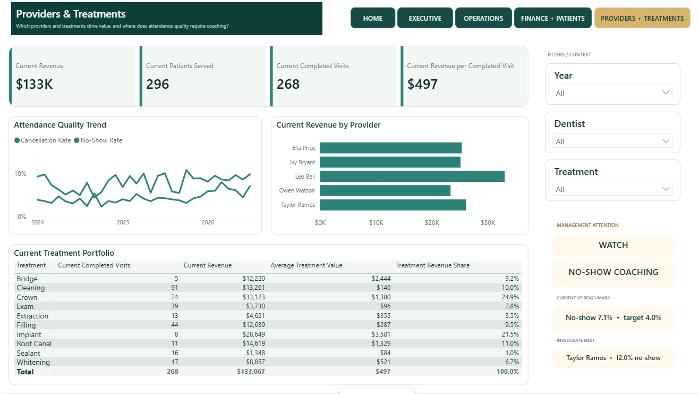

# Pinebridge Dental Arts

**Healthcare operations | Power BI**

Pinebridge is a simulated dental-practice case study linking appointment access and provider activity with attendance, collections, receivables, insurance claims, and treatment mix.

## Purpose

Practice leaders needed to understand whether growth was turning into completed visits while also monitoring cancellations, no-shows, collections, and insurance follow-up.

## Report design

The five-page report covers executive performance, practice operations, finance and patients, and providers and treatments. Appointment status is kept explicit so scheduled, completed, cancelled, and no-show activity are not mixed together.

## Questions covered

- Is growth converting into completed visits and target attainment?
- Which providers need attendance or scheduling support?
- How do treatments contribute to volume and revenue mix?
- Where are collections, receivables, or claim delays building?

## Results shown

- The latest displayed period reports $133K revenue, 296 patients served, and 323 appointments.
- No-shows are 7.1% against a 4.0% target.
- The provider view identifies Taylor Ramos at a 12.0% no-show rate for targeted coaching.
- Treatment mix connects completed visits with value per visit and revenue share.

## Definition to keep in mind

I defined a patient's first visit as the earliest observed visit in the available dataset. It is not a lifetime acquisition date and does not represent activity before the observed history.

## Built with

Power BI, Power Query, DAX, healthcare operations analysis, provider scorecards, claims and receivables analysis, and data validation.
